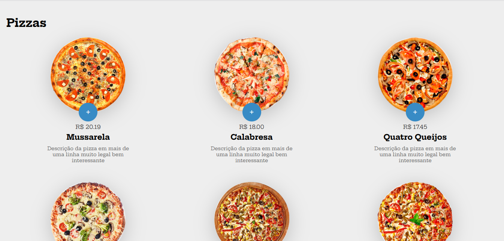
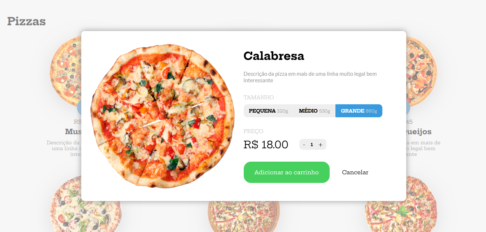
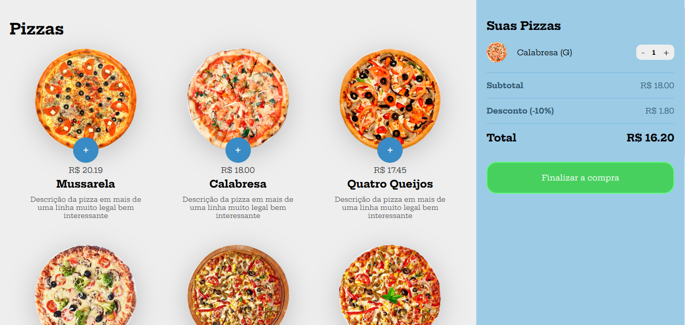

# pedePizza
## Criação de front-end para um sistema de pedidos em uma pizzaria.

### :green_circle: Status do Projeto
#### :heavy_check_mark:  Concluido.

### :green_circle: Demonstração da Aplicação
#### :computer: Tela Principal

#### :computer: Modal de Seleção da Pizza

#### :computer: Carrinho de Compras

